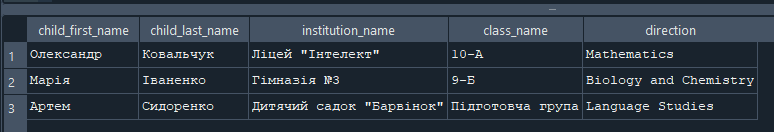
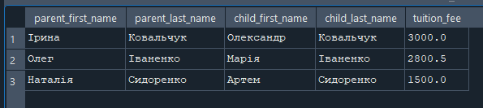
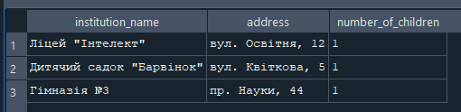
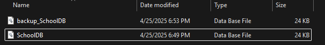
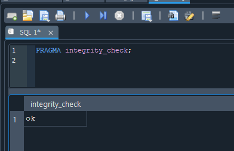
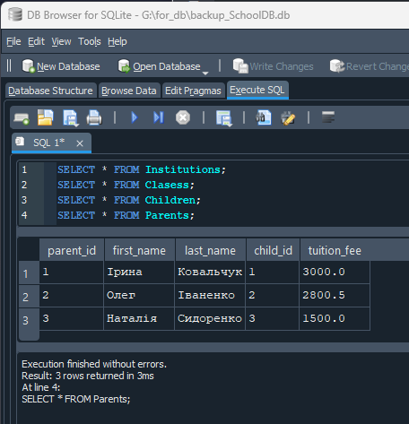

## Lecture 13 SQL

### ДОМАШНЄ ЗАВДАННЯ
**Завдання:** Створення бази даних для шкіл та дитячих садочків
**Мета:** навчитися створювати базу даних із пов’язаними таблицями в MySQL та реалізувати зв’язки між таблицями.
**Умови завдання:**
1. Створення бази даних:
- Створіть базу даних з назвою SchoolDB


2. Таблиця Institutions:
- Створіть таблицю Institutions, яка зберігатиме інформацію про школи та дитячі садочки
- Поля таблиці:
    - *institution_id* — первинний ключ, автоінкремент
    - *institution_name* — назва закладу
    - *institution_type* — тип закладу (вибір між 'School' та 'Kindergarten')
    - *address* — адреса закладу

    ``` sql
    CREATE TABLE Institutions (
    institution_id INTEGER PRIMARY KEY AUTOINCREMENT,
    institution_name TEXT NOT NULL,
    institution_type TEXT CHECK (institution_type IN ('School', 'Kindergarten')) NOT NULL,
    address TEXT NOT NULL
    );
    ```


3. Таблиця Classes:
- Створіть таблицю Classes, яка зберігатиме інформацію про навчальні класи та напрями.
- Поля таблиці:
    - class_id — первинний ключ, автоінкремент
    - class_name — назва класу
    - institution_id — зовнішній ключ на таблицю Institutions
    - direction — напрям навчання, вибір між: "Mathematics", "Biology and Chemistry" "Language Studies"

```sql
CREATE TABLE Clasess (
class_id INTEGER PRIMARY KEY AUTOINCREMENT,
class_name TEXT NOT NULL,
institution_id INTEGER NOT NULL,
direction TEXT CHECK (direction IN ('Mathematics', 'Biology and Chemistry', 'Language Studies')) NOT NULL,
FOREIGN KEY (institution_id) REFERENCES Institutions (institution_id)
);
```


4. Таблиця Children:
- Створіть таблицю Children, яка зберігатиме інформацію про дітей.
- Поля таблиці:
    - child_id — первинний ключ, автоінкремент
    - first_name — ім’я дитини
    - last_name — прізвище дитини
    - birth_date — дата народження
    - year_of_entry — рік вступу
    - age — вік дитини (тип INT)
    - institution_id — зовнішній ключ на таблицю Institutions
    - class_id — зовнішній ключ на таблицю Classes
```sql
CREATE TABLE Children(
child_id INTEGER PRIMARY KEY AUTOINCREMENT,
first_name TEXT NOT NULL,
last_name TEXT NOT NULL,
birth_day DATE NOT NULL,
year_of_entry INTEGER,
age INTEGER NOT NULL,
institution_id INTEGER NOT NULL,
class_id INTEGER NOT NULL,
FOREIGN KEY (institution_id) REFERENCES Institutions(institution_id),
FOREIGN KEY (class_id) REFERENCES Clasess(class_id)
);
```


5. Таблиця Parents:
- Створіть таблицю Parents, яка зберігатиме інформацію про батьків.
- Поля таблиці
    - parent_id — первинний ключ, автоінкремент
    - first_name — ім’я батька/матері
    - last_name — прізвище батька/матері
    - child_id — зовнішній ключ на таблицю Children
    - tuition_fee — вартість навчання

```sql
CREATE TABLE Parents(
parent_id INTEGER PRIMARY KEY AUTOINCREMENT,
first_name TEXT NOT NULL,
last_name TEXY NOT NULL,
child_id INTEGER NOT NULL,
tuition_fee REAL NOT NULL,
FOREIGN KEY (child_id) REFERENCES Children(child_id)
);
```


6. Операції з даними:
- Вставте принаймні 3 записи в кожну таблицю з реалістичними даними (імітація реальних закладів, класів, дітей, батьків та навчальних напрямів).
```sql
INSERT INTO Institutions (institution_name, institution_type, address) VALUES
('Ліцей "Інтелект"', 'School', 'вул. Освітня, 12'),
('Дитячий садок "Барвінок"', 'Kindergarten', 'вул. Квіткова, 5'),
('Гімназія №3', 'School', 'пр. Науки, 44');
```

```sql
INSERT INTO Clasess (class_name, institution_id, direction) VALUES
('10-А', 1, 'Mathematics'),
('9-Б', 3, 'Biology and Chemistry'),
('Підготовча група', 2, 'Language Studies');
```
```sql
INSERT INTO Children (first_name, last_name, birth_day, year_of_entry, age, institution_id, class_id) VALUES
('Олександр', 'Ковальчук', '2010-03-15', 2020, 14, 1, 1),
('Марія', 'Іваненко', '2011-07-20', 2021, 13, 3, 2),
('Артем', 'Сидоренко', '2019-12-01', 2024, 5, 2, 3);
```
```sql
INSERT INTO Parents (first_name, last_name, child_id, tuition_fee) VALUES
('Ірина', 'Ковальчук', 1, 3000.00),
('Олег', 'Іваненко', 2, 2800.50),
('Наталія', 'Сидоренко', 3, 1500.00);
```

7. Запити:
- Виконайте такі запити:
    - Отримайте список всіх дітей разом із закладом, в якому вони навчаються, та напрямом  навчання в класі
    ```sql
    SELECT 
    Children.first_name AS child_first_name,
    Children.last_name AS child_last_name,
    Institutions.institution_name,
    Clasess.class_name,
    Clasess.direction
    FROM 
    Children
    JOIN 
    Institutions ON Children.institution_id = Institutions.institution_id
    JOIN 
    Clasess ON Children.class_id = Clasess.class_id;
    ```
    

    - Отримайте інформацію про батьків і їхніх дітей разом із вартістю навчання
    ```sql
    SELECT 
    p.first_name AS parent_first_name,
    p.last_name AS parent_last_name,
    c.first_name AS child_first_name,
    c.last_name AS child_last_name,
    p.tuition_fee
    FROM 
    Parents p
    JOIN 
    Children c ON p.child_id = c.child_id;
    ```
    

    - Отримайте список всіх закладів з адресами та кількістю дітей, які навчаються в кожному закладі
    ```sql
    SELECT 
    i.institution_name,
    i.address,
    COUNT(c.child_id) AS number_of_children
    FROM 
    Institutions i
    LEFT JOIN 
    Children c ON i.institution_id = c.institution_id
    GROUP BY 
    i.institution_id;
    ```
    

8. Зробіть бекап бази та застосуйте його для нової бази даних і перевірте, що цілісність даних не порушено
```python
import sqlite3
import shutil

source_db = r"G:\\for_db\\SchoolDB.db"
backup_db = r"G:\\for_db\\backup_SchoolDB.db"

shutil.copyfile(source_db, backup_db)
```



**Запустив перевірку цілістності даних та пошуку помилок**


Все виконалося без помилок.
