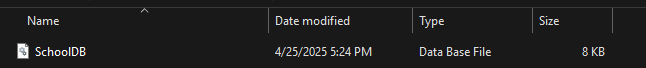
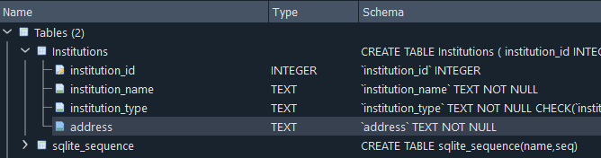
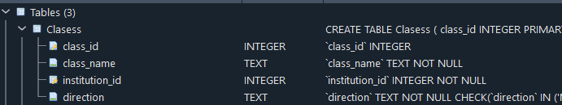
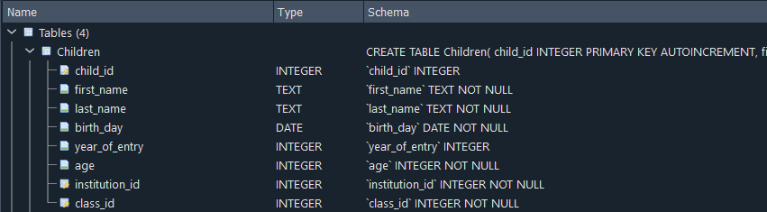
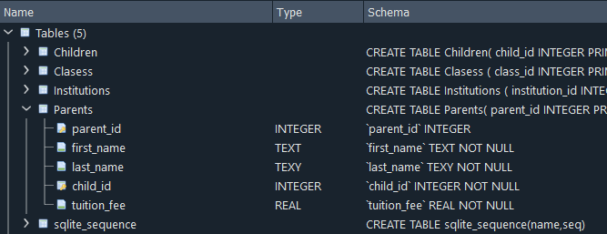

## Lecture 13 SQL

### ДОМАШНЄ ЗАВДАННЯ
**Завдання:** Створення бази даних для шкіл та дитячих садочків
**Мета:** навчитися створювати базу даних із пов’язаними таблицями в MySQL та реалізувати зв’язки між таблицями.
**Умови завдання:**
1. Створення бази даних:
- Створіть базу даних з назвою SchoolDB


2. Таблиця Institutions:
- Створіть таблицю Institutions, яка зберігатиме інформацію про школи та дитячі садочки
- Поля таблиці:
    - *institution_id* — первинний ключ, автоінкремент
    - *institution_name* — назва закладу
    - *institution_type* — тип закладу (вибір між 'School' та 'Kindergarten')
    - *address* — адреса закладу

    ``` sql
    CREATE TABLE Institutions (
    institution_id INTEGER PRIMARY KEY AUTOINCREMENT,
    institution_name TEXT NOT NULL,
    institution_type TEXT CHECK (institution_type IN ('School', 'Kindergarten')) NOT NULL,
    address TEXT NOT NULL
    );
    ```


3. Таблиця Classes:
- Створіть таблицю Classes, яка зберігатиме інформацію про навчальні класи та напрями.
- Поля таблиці:
    - class_id — первинний ключ, автоінкремент
    - class_name — назва класу
    - institution_id — зовнішній ключ на таблицю Institutions
    - direction — напрям навчання, вибір між: "Mathematics", "Biology and Chemistry" "Language Studies"

```sql
CREATE TABLE Clasess (
class_id INTEGER PRIMARY KEY AUTOINCREMENT,
class_name TEXT NOT NULL,
institution_id INTEGER NOT NULL,
direction TEXT CHECK (direction IN ('Mathematics', 'Biology and Chemistry', 'Language Studies')) NOT NULL,
FOREIGN KEY (institution_id) REFERENCES Institutions (institution_id)
);
```



4. Таблиця Children:
- Створіть таблицю Children, яка зберігатиме інформацію про дітей.
- Поля таблиці:
    - child_id — первинний ключ, автоінкремент
    - first_name — ім’я дитини
    - last_name — прізвище дитини
    - birth_date — дата народження
    - year_of_entry — рік вступу
    - age — вік дитини (тип INT)
    - institution_id — зовнішній ключ на таблицю Institutions
    - class_id — зовнішній ключ на таблицю Classes
```sql
CREATE TABLE Children(
child_id INTEGER PRIMARY KEY AUTOINCREMENT,
first_name TEXT NOT NULL,
last_name TEXT NOT NULL,
birth_day DATE NOT NULL,
year_of_entry INTEGER,
age INTEGER NOT NULL,
institution_id INTEGER NOT NULL,
class_id INTEGER NOT NULL,
FOREIGN KEY (institution_id) REFERENCES Institutions(institution_id),
FOREIGN KEY (class_id) REFERENCES Clasess(class_id)
);
```



5. Таблиця Parents:
- Створіть таблицю Parents, яка зберігатиме інформацію про батьків.
- Поля таблиці
    - parent_id — первинний ключ, автоінкремент
    - first_name — ім’я батька/матері
    - last_name — прізвище батька/матері
    - child_id — зовнішній ключ на таблицю Children
    - tuition_fee — вартість навчання

```sql
CREATE TABLE Parents(
parent_id INTEGER PRIMARY KEY AUTOINCREMENT,
first_name TEXT NOT NULL,
last_name TEXY NOT NULL,
child_id INTEGER NOT NULL,
tuition_fee REAL NOT NULL,
FOREIGN KEY (child_id) REFERENCES Children(child_id)
);
```



6. Операції з даними:
- Вставте принаймні 3 записи в кожну таблицю з реалістичними даними (імітація реальних закладів, класів, дітей, батьків та навчальних напрямів).
7. Запити:
- Виконайте такі запити:
    - Отримайте список всіх дітей разом із закладом, в якому вони навчаються, та напрямом  навчання в класі
    - Отримайте інформацію про батьків і їхніх дітей разом із вартістю навчання
    - Отримайте список всіх закладів з адресами та кількістю дітей, які навчаються в кожному закладі
8. Зробіть бекап бази та застосуйте його для нової бази даних і перевірте, що цілісність даних не порушено
**Очікуваний результат:**
- Студенти створять повноцінну базу даних із кількома пов’язаними таблицями
- Виконають запити на отримання необхідної інформації
- Зрозуміють принципи роботи з FOREIGN KEY і створення зв’язків між таблицями в MySQL
