## LECTURE 14
**Завдання:** робота з MongoDB на тему спортзалу
**Ціль:** створення бази даних для спортзалу, в якій зберігатимуть дані про клієнтів, їхнє членство, тренування і тренерів. 
**Кроки для виконання:**
- Створення бази даних та колекцій:
    - Назвіть базу даних як gymDatabase
    Створення БД через compas

    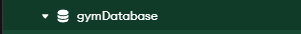
    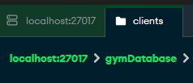

    - Створіть колекції: clients, memberships, workouts, trainers
    Створення колекцій через інтерфейс

    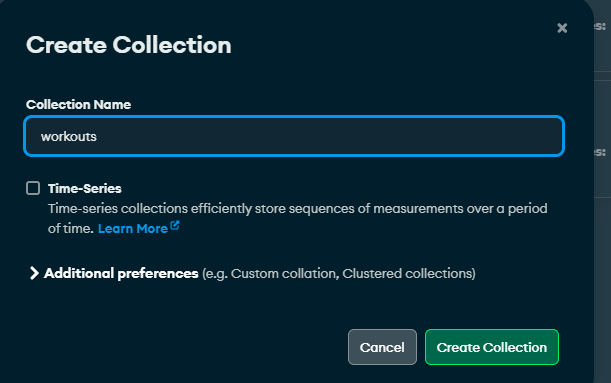

    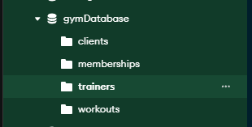
    Загальний вигляд:
    
    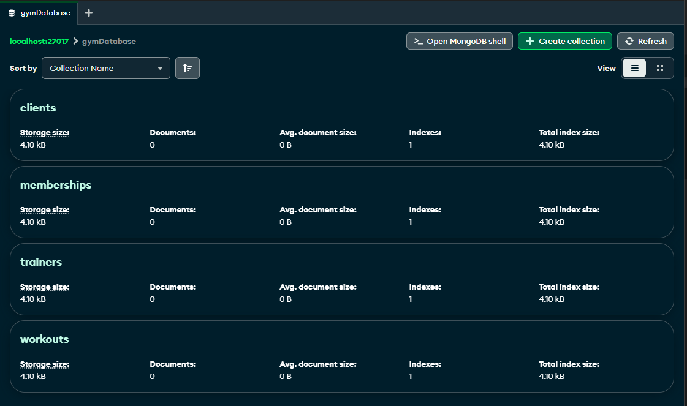

- Визначення схеми документів:
    - Clients: client_id, name, age, email
    Створення схеми та заповнення колекцій даними

    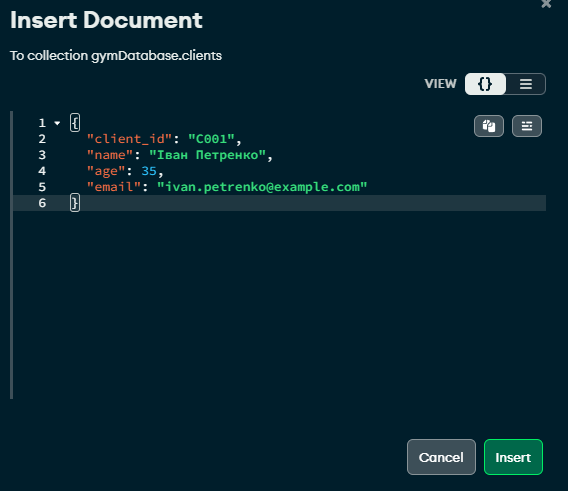


    Загальний вигля колекції


    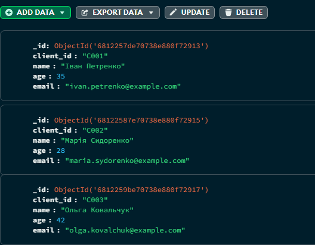

    - Memberships: membership_id, client_id, start_date, end_date, type
    Заповення даними:
    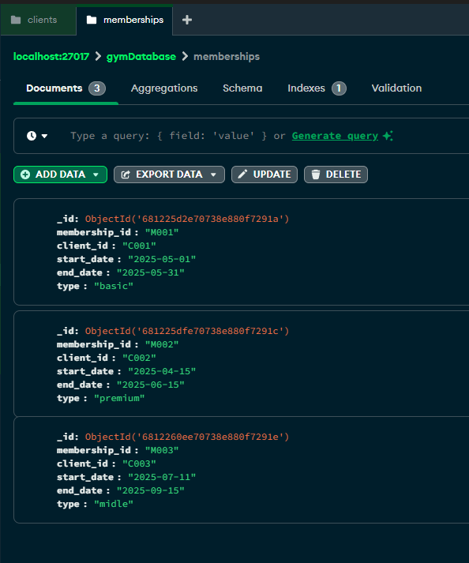
    
    - Workouts: workout_id, description, difficulty
    Аналогічне заповнення колецій
    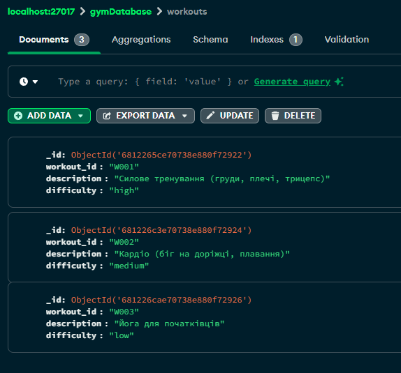

    - Trainers: trainer_id, name, specialization

    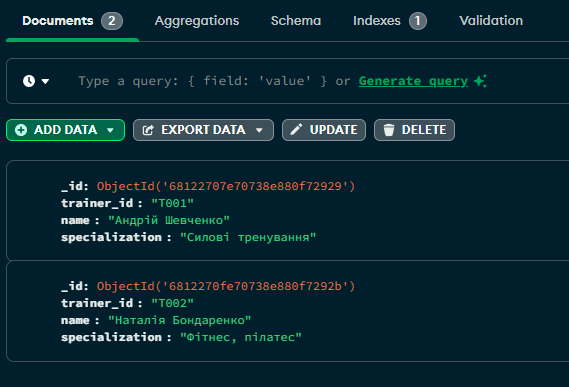

- Заповнення колекцій даними:
    - Додайте кілька записів до кожної колекції

    Записи були одразу додані при побудові схеми

- Запити:
    - Знайдіть всіх клієнтів віком понад 30 років
    Запит через інтерфейс compas:
    код запиту в колекції client: `{ "age": { "$gt": 30 } }`
    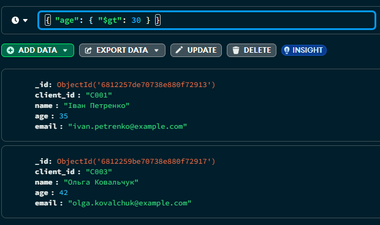

    - Перелічіть тренування із середньою складністю
    Код запиту: `{difficulty: "medium"}`
    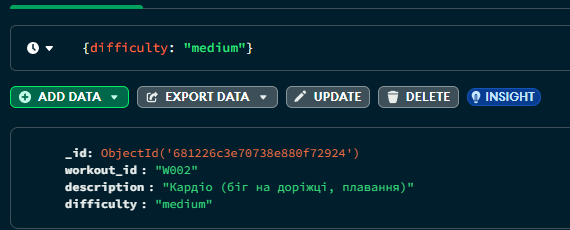
    - Покажіть інформацію про членство клієнта з певним client_id
    Код запиту: { "client_id": "C002" }
    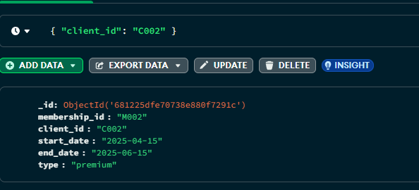

**Виконання запитів через консоль mongosh:**
- Знайдіть всіх клієнтів віком понад 30 років
    ```js
    use gymDatabase
    switched to db gymDatabase
    db.clients.find({age: {$gt:30}})
    ```
    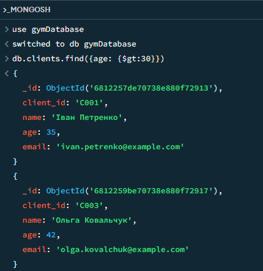
- Тренування із сердньою скаладністю:
    ```js
    db.workouts.find({difficulty: "medium"})
    ```
    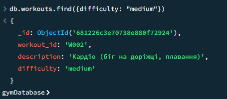

- Покажіть інформацію про членство клієнта з певним client_id
    ```js
    db.memberships.find({client_id: "C003"})
    ```
    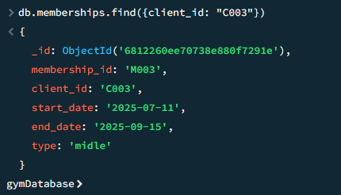
