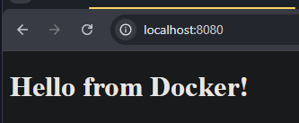
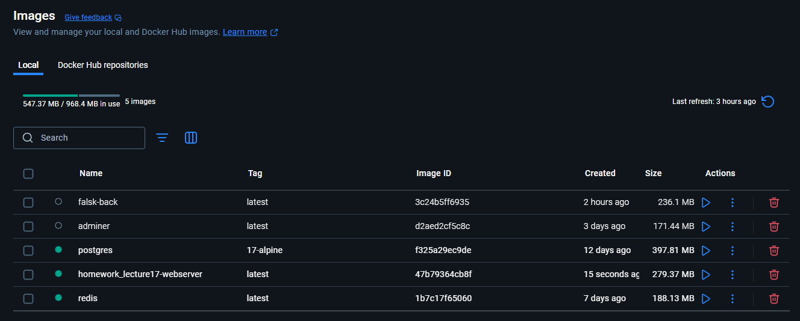
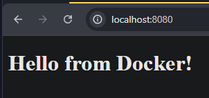

# Lecture 17
## Завдання 1: Створення файлу docker-compose.yml 
1. Створіть новий каталог для вашого проєкту:
    - Назвіть його, наприклад, multi-container-app
2. Створіть docker-compose.yml файл:
    - У цьому файлі буде визначено конфігурацію для вебсервера, бази даних та кешу
    - Додайте до docker-compose.yml файлу образи nginx, postgres та redis
    - Додайте volume db-data для postgresql, та web-data для nginx
    - Додайте спільну мережу appnet
    - Створіть файл index.html з простим змістом і додайте до web-data приклад коду:
### Файл Docker compose:
```yaml
services:
  webserver:
    image: nginx:latest
    container_name: nginx
    volumes:
      - web-data:/usr/share/nginx/html 
    ports:
      - "8080:80"
    networks:
      - appnet

  
  database:
    image: postgres:17-alpine
    container_name: psgr
    environment:
      - POSTGRES_USER=user
      - POSTGRES_PASSWORD=password
      - POSTGRES_DB=mydb
    volumes:
      - db-data:/var/lib/postgresql/data
    networks:
      - appnet

  cache:
    image: redis:latest
    container_name: redis
    networks:
    - appnet

volumes:
  web-data:
  db-data:
networks:
  appnet:
    driver: bridge


```
Файли знаходяться в окремфй дерикторії for_web
Вміст Dockerfile:
```Dockerfile
FROM nginx
COPY index.html /usr/share/nginx/html/index.html
```
Вміст index.html:
```html
<!DOCTYPE html>
    <html>
        <head>
            <title>My Docker App</title>
        </head>
    <body>
        <h1>Hello from Docker!</h1>
    </body>
    </html>
```
Запуск білда та контейнерів:
Один з томів було створено раніше

```shell
PS G:\for_docker_image\homework_lecture17> docker compose up -d
[+] Running 1/1
 ✔ webserver Pulled                                                                                                                                       1.3s 
[+] Running 5/5
 ✔ Network homework_lecture17_appnet     Created                                                                                                          0.0s 
 ✔ Volume "homework_lecture17_web-data"  Created                                                                                                          0.0s 
 ✔ Container redis                       Started                                                                                                          0.5s 
 ✔ Container nginx                       Started                                                                                                          0.5s 
 ✔ Container psgr                        Started   

```
Було зроблено копіювання файлу у том для веб-серверу, щоб можна було побачити кастомну сторінку
```shell
PS G:\for_docker_image\homework_lecture17> docker run --rm -v G:/for_docker_image/homework_lecture17/for_web:/src -v homework_lecture17_web-data:/dest busybox sh -c "cp /src/index.html /dest/index.html"
Unable to find image 'busybox:latest' locally
latest: Pulling from library/busybox
97e70d161e81: Pull complete
Digest: sha256:37f7b378a29ceb4c551b1b5582e27747b855bbfaa73fa11914fe0df028dc581f
Status: Downloaded newer image for busybox:latest
```

Перевірка роботи веб-серверу:




## Завдання 3: Запуск багатоконтейнерного застосунку
1. Запустіть застосунок за допомогою Docker Compose:
- Використовуйте команду docker-compose up -d для запуску всіх сервісів у фоновому режимі
```shell
PS G:\for_docker_image\homework_lecture17> docker compose up -d
[+] Running 1/1
 ✔ webserver Pulled                                                                                                                                       1.3s 
[+] Running 5/5
 ✔ Network homework_lecture17_appnet     Created                                                                                                          0.0s 
 ✔ Volume "homework_lecture17_web-data"  Created                                                                                                          0.0s 
 ✔ Container redis                       Started                                                                                                          0.5s 
 ✔ Container nginx                       Started                                                                                                          0.5s 
 ✔ Container psgr                        Started 
```
2. Перевірте стан запущених сервісів:
- Застосовуйте команду docker-compose ps для перегляду стану запущених контейнерів
```shell
PS G:\for_docker_image\homework_lecture17> docker compose ps
NAME      IMAGE                COMMAND                  SERVICE     CREATED         STATUS         PORTS
nginx     nginx:latest         "/docker-entrypoint.…"   webserver   6 minutes ago   Up 6 minutes   0.0.0.0:8080->80/tcp
psgr      postgres:17-alpine   "docker-entrypoint.s…"   database    6 minutes ago   Up 6 minutes   5432/tcp
redis     redis:latest         "docker-entrypoint.s…"   cache       6 minutes ago   Up 6 minutes   6379/tcp
PS G:\for_docker_image\homework_lecture17>
```
3. Перевірте роботу вебсервера:
- Відкрийте браузер та перейдіть за адресою http://localhost:8080. Ви повинні побачити 
сторінку nginx.


## Завдання 4: Налаштування мережі й томів
1. Досліджуйте створені мережі та томи:
- Використовуйте команди docker network ls та docker volume ls для перегляду створених мереж і томів
Перевірка мережі
```shell
PS G:\for_docker_image\homework_lecture17> docker network ls
NETWORK ID     NAME                        DRIVER    SCOPE
75def835bfb3   bridge                      bridge    local
2d0a8631dcd0   homework_lecture17_appnet   bridge    local
7627990f968b   host                        host      local
78fda965ce90   none                        null      local
```
Перевірка томів
```shell
PS G:\for_docker_image\homework_lecture17> docker volume ls
DRIVER    VOLUME NAME
local     8ba2efc3af8abe7b9eaf383241270df9fc9c365d5d1edc1b8e633f51d1d2ce3a
local     2384b3966d1d5079cd3418bd39b67455f11e9f74c306d33b86ecd06111937886
local     for_docker_compose_postgres-data
local     homework_lecture17_db-data
local     homework_lecture17_web-data
local     postgres-data
local     web_files
```
2. Перевірте підключення до бази даних:
● Застосовуйте команду docker exec для підключення до бази даних PostgreSQL всередині 
контейнера. <db_container_id> можна отримати з команди docker-compose ps.
```shell
PS G:\for_docker_image\homework_lecture17> docker exec -it psgr psql -U user -d mydb
psql (17.5)
Type "help" for help.

mydb=# exit
```
## Завдання 5: Масштабування сервісів
1. Масштабуйте вебсервер:
- Використовуйте команду docker-compose up -d --scale web=3 для запуску  трьох екземплярів вебсервера
```shell
PS G:\for_docker_image\homework_lecture17> docker compose up -d --scale webserver=3
[+] Running 2/2
 ✔ Container redis  Running                                                                                                                               0.0s 
 ✔ Container psgr   Running                                                                                                                               0.0s 
WARNING: The "webserver" service is using the custom container name "nginx". Docker requires each container to have a unique name. Remove the custom name to scale the service.

PS G:\for_docker_image\homework_lecture17>
```
Виникла помилка маштабування:
Зупинив контейнер: `PS G:\for_docker_image\homework_lecture17> docker stop nginx` та видалив

необхідно прибрати строге ім'я: закоментував рядок `#container_name: nginx`

Також закоментував рядок з портом, не працювало з маштабуванням 
перезапуск з маштабуванням:
```shell
PS G:\for_docker_image\homework_lecture17> docker compose up -d --scale webserver=3
[+] Running 6/6
 ✔ Network homework_lecture17_appnet         Created                                                                                                     0.0s 
 ✔ Container psgr                            Started                                                                                                     0.6s 
 ✔ Container redis                           Started                                                                                                     0.6s 
 ✔ Container homework_lecture17-webserver-3  Started                                                                                                     0.4s 
 ✔ Container homework_lecture17-webserver-1  Started                                                                                                     0.7s 
 ✔ Container homework_lecture17-webserver-2  Started                                                                                                     0.9s 
PS G:\for_docker_image\homework_lecture17> 
```

2. Перевірте стан масштабованих сервісів:
- Використовуйте команду docker-compose ps для перегляду стану запущених контейнерів

```shell
 ✔ Container homework_lecture17-webserver-2  Started                                                                                                     0.9s 
PS G:\for_docker_image\homework_lecture17> docker compose ps
NAME                             IMAGE                COMMAND                  SERVICE     CREATED          STATUS          PORTS
homework_lecture17-webserver-1   nginx:latest         "/docker-entrypoint.…"   webserver   53 seconds ago   Up 51 seconds   80/tcp
homework_lecture17-webserver-2   nginx:latest         "/docker-entrypoint.…"   webserver   53 seconds ago   Up 51 seconds   80/tcp
homework_lecture17-webserver-3   nginx:latest         "/docker-entrypoint.…"   webserver   53 seconds ago   Up 51 seconds   80/tcp
psgr                             postgres:17-alpine   "docker-entrypoint.s…"   database    53 seconds ago   Up 51 seconds   5432/tcp
redis                            redis:latest         "docker-entrypoint.s…"   cache       53 seconds ago   Up 51 seconds   6379/tcp
PS G:\for_docker_image\homework_lecture17> 
```