# Lecture 22
## AWS Basics
### Опис завдання 
#### 1. Створення та налаштування VPC
- Створіть нову VPC:
- Використайте консоль AWS для створення VPC.
- Виберіть CIDR-блок
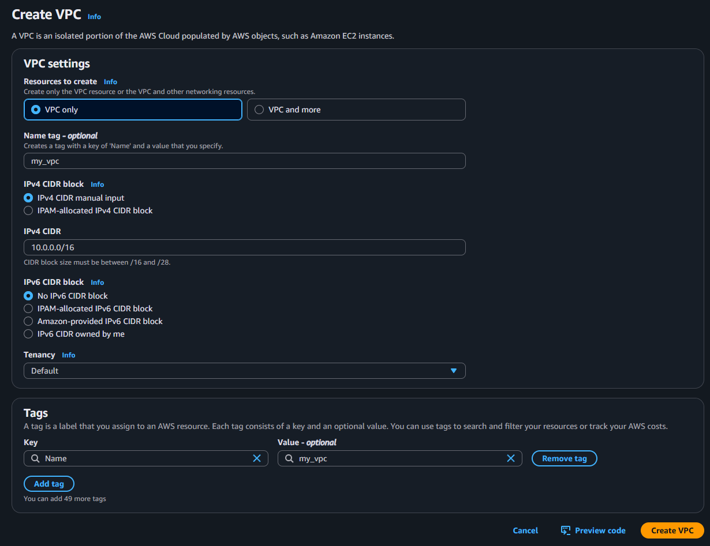

- Створіть дві підмережі в VPC:
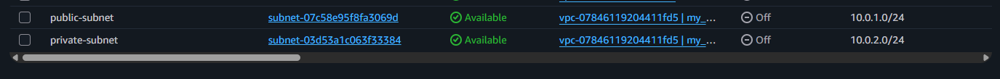

- Створіть одну публічну підмережу з CIDR-блоком.
- Створіть одну приватну підмережу з CIDR-блоком.

*Створення приватної та публічної підмережі*

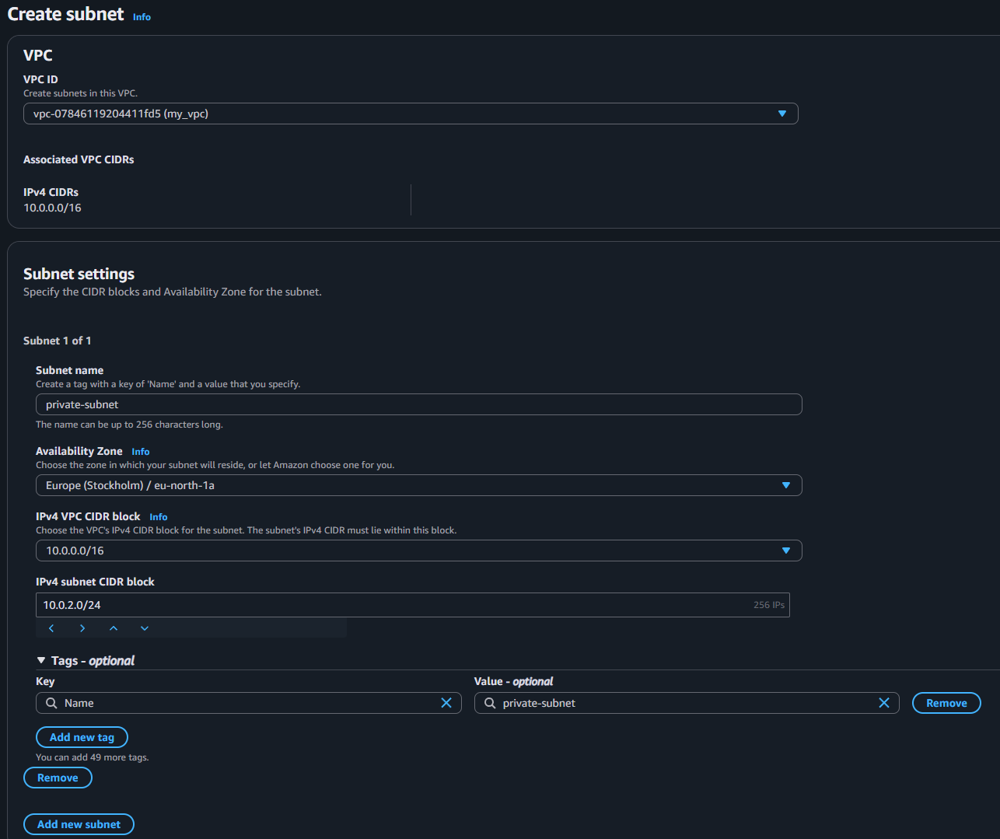

- Створіть та налаштуйте інтернет-шлюз (Internet Gateway):

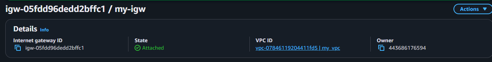

- Прив'яжіть інтернет-шлюз до вашої VPC.
*Прив'язка до vpc*
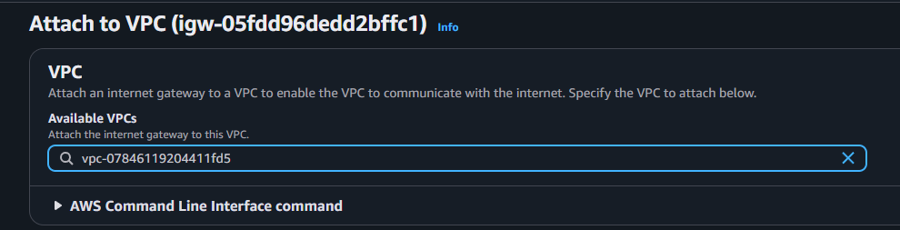

- Налаштуйте таблиці маршрутизації для забезпечення доступу до інтернету з публічної підмережі.
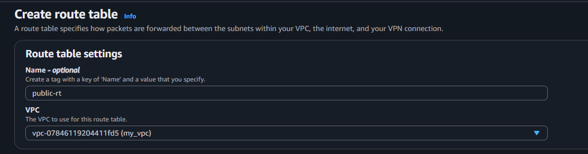

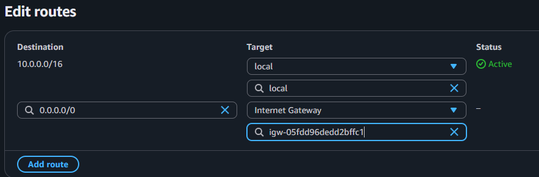

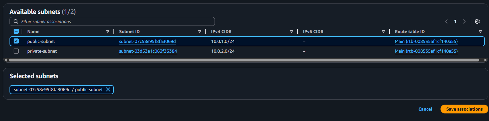

#### 2. Налаштування груп безпеки (Security Groups) та списків контролю доступу (ACL)
- Додайте правила для дозволу вхідного HTTP та SSH трафіку з будь-якої IP-адреси.

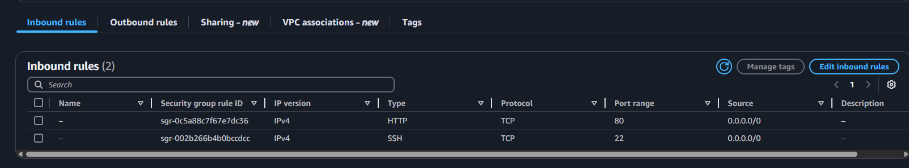

#### 3. Запуск інстансу EC2
- Запустіть новий інстанс EC2:
- Використайте Amazon Linux 2 AMI.
- Виберіть тип інстансу, наприклад, t2.micro. Оскільки він безкоштовний.
- Прив'яжіть інстанс до публічної підмережі.
- Використайте Security Group, створену на попередньому кроці.
- Завантажте та використайте SSH-ключ для доступу до інстансу.
*Конфігурація мережі інстансу та ключа*

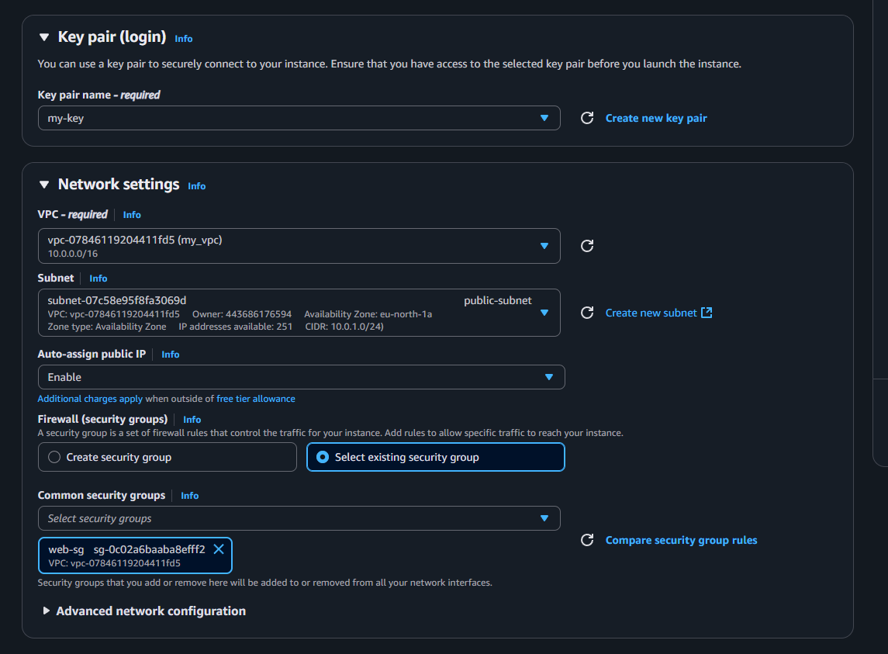

*Запуск*

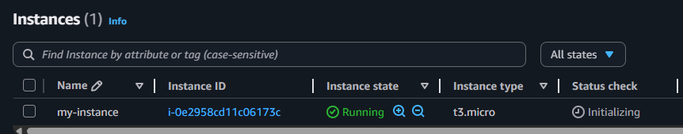

*Перевірка роботи*

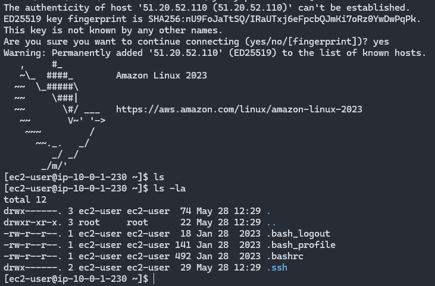

#### 4. Призначення еластичної IP-адреси (EIP)
- Створіть та призначте EIP до вашого інстансу:

- Створіть нову EIP в AWS консолі.

- Прив'яжіть EIP до запущеного інстансу EC2.

Прив'язана EIP до інстансу
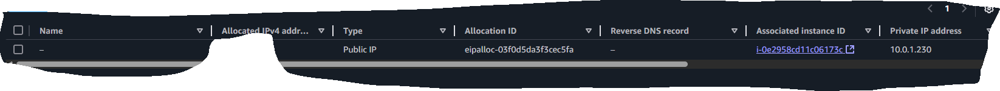
Перевірка доступності з браузеру
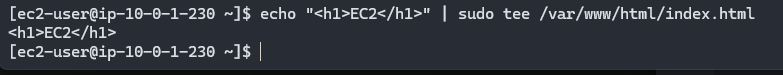

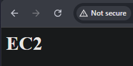
