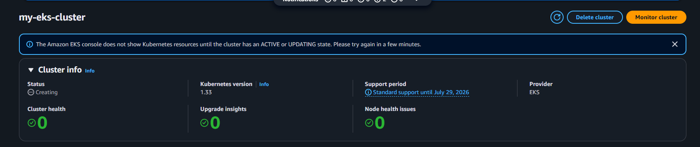
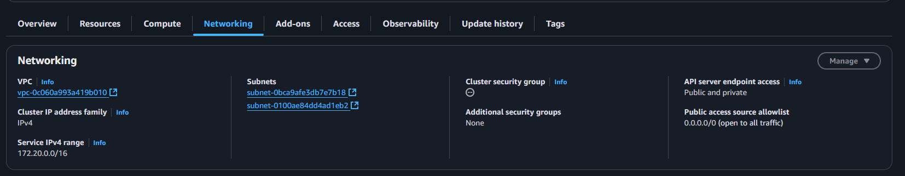
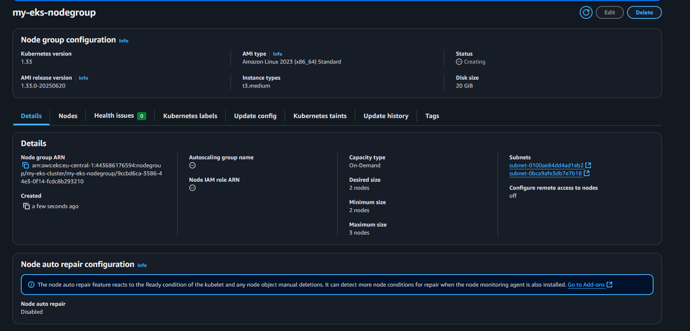

# Lecture25 (AWS EKS)

## Мета
**Навчитися:**
- Створювати кластер Kubernetes в AWS за допомогою EKS
- Розгортати застосунки в кластері
- Працювати з основними ресурсами Kubernetes (Pod, Deployment, Service, ConfigMap, PersistentVolumeClaim)

### Завдання
#### 1. Створити кластер EKS
- Використовуючи AWS Management Console або CLI, створіть кластер EKS
- Кластер повинен складатися щонайменше з двох воркер-нод (Node Groups) у публічній підмережі
- Застосовуйте EC2 інстанси типу t3.medium

#### 2. Налаштувати kubectl для доступу до кластера
- Підключіть локальний kubectl до вашого кластера
- Переконайтеся, що команда kubectl get nodes показує воркер-ноди кластера
#### 3. Розгорнути статичний вебсайт
- Створіть Deployment, який розгортає статичний вебсайт на основі образу nginx
- Використовуйте ConfigMap для передачі файлів вебсайту (наприклад, index.html)
- Розгорніть Service типу LoadBalancer, щоб зробити вебсайт доступним через публічний IP
#### 4. Створити PersistentVolumeClaim для збереження даних
- Використовуйте динамічне створення сховища (StorageClass), щоб зробити PersistentVolumeClaim
- Розгорніть Pod, який застосовує цей PVC, щоб зберігати дані на EBS-диску
#### 5. Запуск завдання за допомогою Job
- Створіть Job, який виконує просту команду, наприклад, echo "Hello from EKS!"
- Переконайтеся, що Job виконується успішно
#### 6. Розгорнути тестовий застосунок
- Розгорніть застосунок з образу httpd (Apache HTTP Server) або nginx
- Використовуйте Deployment для створення двох реплік
- Налаштуйте Service типу ClusterIP для доступу до застосунку всередині кластера
#### 7. Робота з неймспейсами
- Створіть окремий namespace dev і розгорніть у ньому застосунок з 5 репліками на основі образу busybox Контейнер повинен виконувати команду sleep 3600.
#### 8. Очистити ресурси
- (ployment, Pod, Service, PVC тощо) після завершення роботи

