# Lecture27
Завдання: розгортання бази даних для трекінгу книг на AWS RDS
### Мета завдання
 Навчитися створювати, налаштовувати й працювати з базою даних, використовуючи сервіс AWS 
RDS. Закріпити навички роботи з SQL, управління доступом, моніторингу та резервного 
копіювання.
### Опис ситуації
Ви працюєте над застосунком для трекінгу книг. Застосунок зберігає інформацію про книги, 
авторів та статус читання кожної книги. Для реалізації цього завдання вам потрібно створити 
базу даних в AWS RDS і виконати базові операції.
 ## Завдання
 ### 1. Створення RDS-інстансу
 Увійдіть до AWS Management Console.
 Відкрийте сервіс RDS та створіть інстанс бази даних:
 - Оберіть Create database
 - Тип бази: MySQL (можна обрати PostgreSQL за бажанням)
 - Шаблон: Free tier
 - Конфігурація:
 - DB instance identifier: library-db
 - Master username: admin
 - Master password: створіть надійний пароль
 - DB instance class: db.t3.micro
 - Дисковий простір: 20 ГБ (General Purpose SSD)

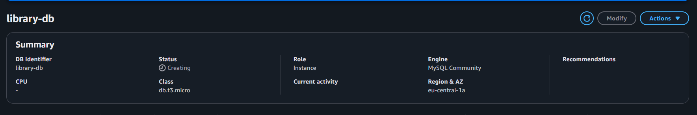

 - Увімкніть Public access для підключення до бази з вашого комп’ютера
 - У розділі Network & Security:
 - Оберіть наявну VPC або створіть нову
 - Додайте нову security group, що дозволяє доступ лише з вашого IP
 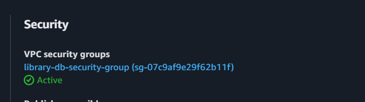

 Дочекайтеся завершення створення інстансу.

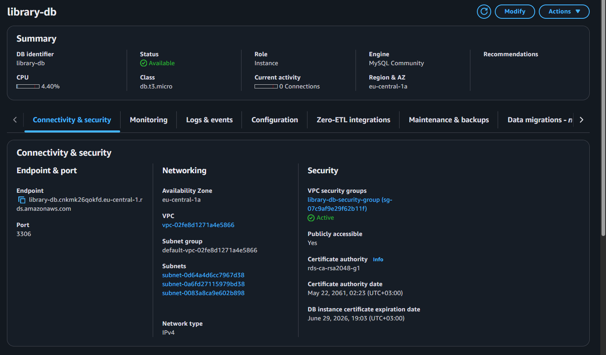

### 2. Підключення до бази
- Підключіться до бази даних за допомогою SQL-клієнта (наприклад, MySQL Workbench).
- Використовуйте параметри підключення, надані в RDS (адреса хоста, порт 3306, ім’я користувача admin та 
пароль).
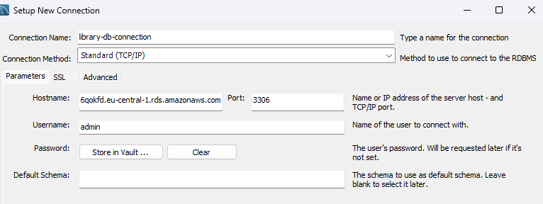

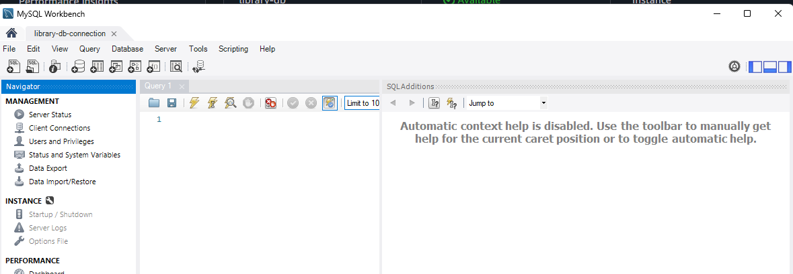

 ### 3. Створення бази даних і таблиць
 Створіть базу даних library:
 ```sql 
 CREATE DATABASE library;
 USE library;
 ```
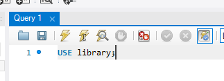


 Створіть три таблиці для зберігання даних про авторів, книги та статус читання:
 ```sql
 CREATE TABLE authors (
    id INT AUTO_INCREMENT PRIMARY KEY,
    name VARCHAR(255) NOT NULL,
    country VARCHAR(255)
 );
 CREATE TABLE books (
    id INT AUTO_INCREMENT PRIMARY KEY,
    title VARCHAR(255) NOT NULL,
    author_id INT,
    genre VARCHAR(50),
    FOREIGN KEY (author_id) REFERENCES authors(id)
 );
 CREATE TABLE reading_status (
    id INT AUTO_INCREMENT PRIMARY KEY,
    book_id INT,
    status ENUM('reading', 'completed', 'planned') NOT NULL,
    last_updated TIMESTAMP DEFAULT CURRENT_TIMESTAMP,
    FOREIGN KEY (book_id) REFERENCES books(id)
 );
 ```

 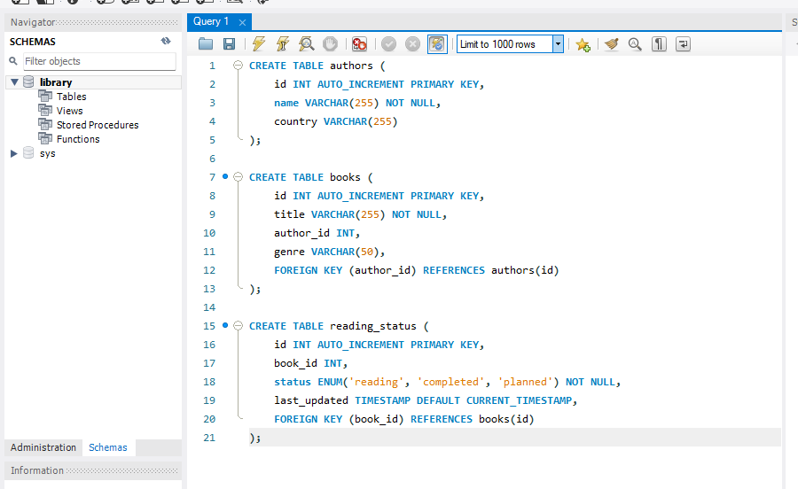

### 4. Внесення даних
 Додайте кількох авторів:
```sql 
INSERT INTO authors (name, country) 
VALUES 
('George Orwell', 'United Kingdom'),
 ('J.K. Rowling', 'United Kingdom'),
 ('Haruki Murakami', 'Japan');
 Додайте кілька книг:
 INSERT INTO books (title, author_id, genre) VALUES 
('1984', 1, 'Dystopian'),
 ('Harry Potter and the Philosopher\'s Stone', 2, 'Fantasy'),
 ('Kafka on the Shore', 3, 'Magical realism'); 
Додайте статус для однієї з книг:
 INSERT INTO reading_status (book_id, status) VALUES 
(1, 'reading');
```

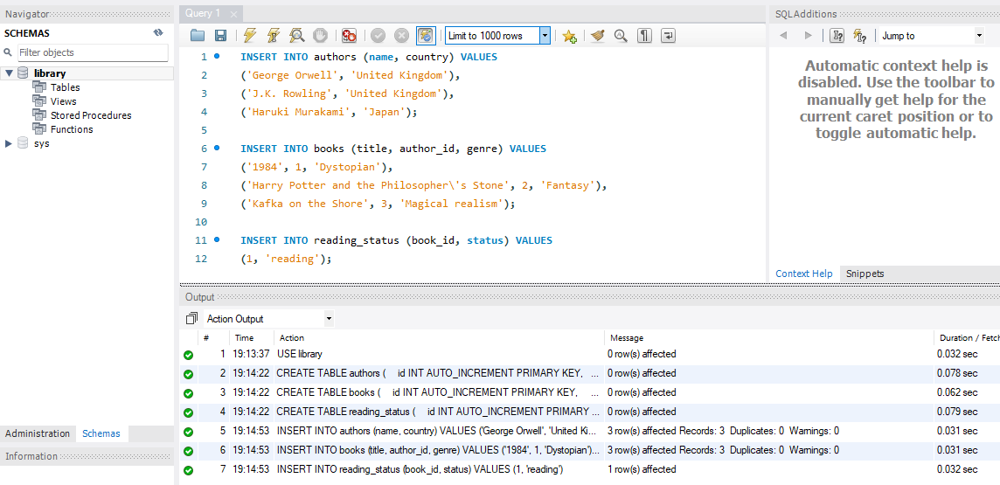

### 5. Виконання запитів
 Знайдіть усі книги, які ще не прочитані:
 ```sql SELECT books.title, authors.name 
 FROM books
 JOIN authors ON books.author_id = authors.id
 LEFT JOIN reading_status ON books.id = reading_status.book_id
 WHERE reading_status.status IS NULL OR reading_status.status != 'completed';
 ```
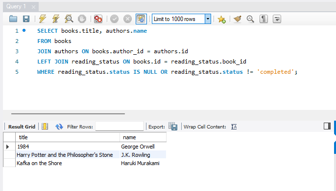

 Визначте кількість книг, які в процесі читання:
  ```sql
 SELECT COUNT(*) AS reading_books
 FROM reading_status
 WHERE status = 'reading';
 ```
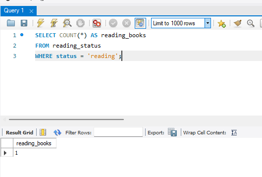


 ### 6. Налаштування доступу
 Створіть нового користувача для бази даних:
 ```sql 
 CREATE USER 'library_user'@'%' IDENTIFIED BY 'strong_password'; 
 ```
 Надайте йому права:
 ```sql 
 GRANT SELECT, INSERT, UPDATE ON library.* TO 'library_user'@'%';
 ```
 FLUSH PRIVILEGES;

 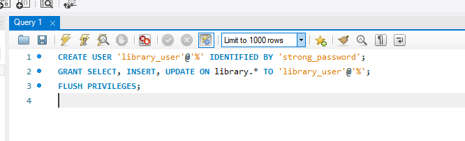

 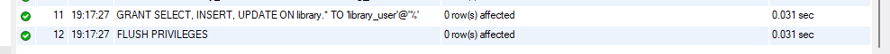

 7. Моніторинг та резервне копіювання
 - Увімкніть автоматичне резервне копіювання у налаштуваннях RDS (Backup retention period: 7 днів).
 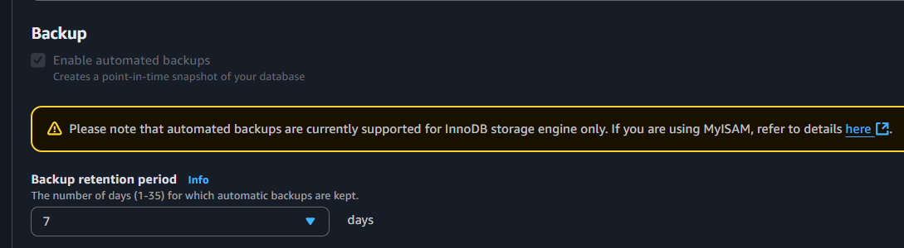

 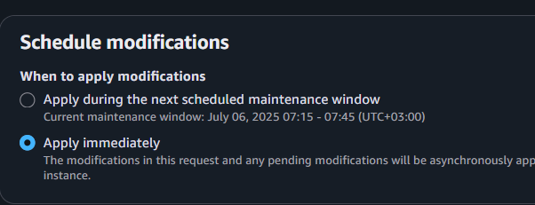

 - Перегляньте метрики вашого інстансу в CloudWatch (CPU utilization, connections, IOPS)

 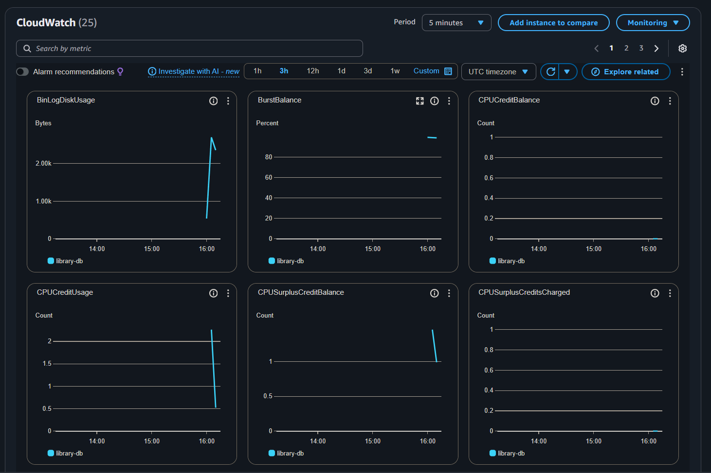