## Lecture_6

## Advanced Linux

1. **Завдання: встановити й налаштувати вебсервер Nginx через офіційний репозиторій. Додати й видалити PPA-репозиторій для Nginx, а потім повернутися до офіційної версії пакета за допомогою ppa-purge.**
- Встановлення nginx з офіційного репозиторія
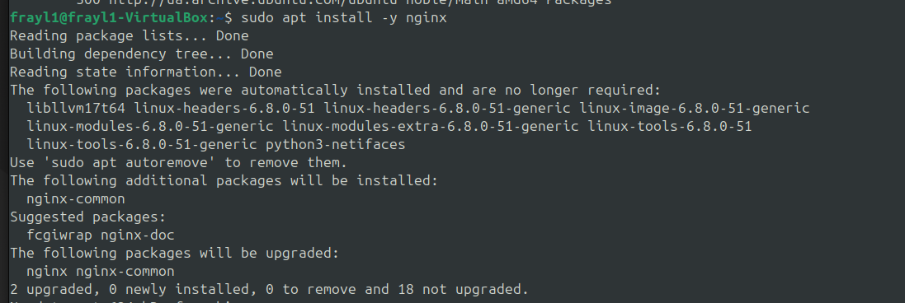
- Перевірка роботи
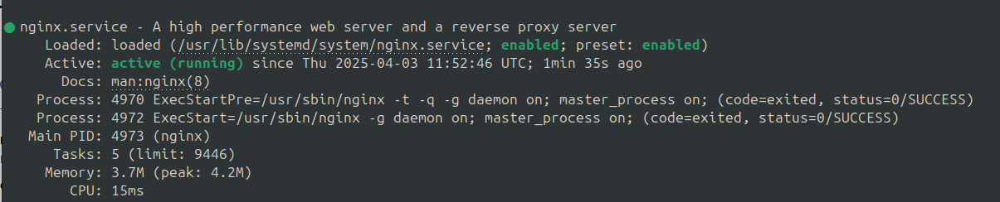
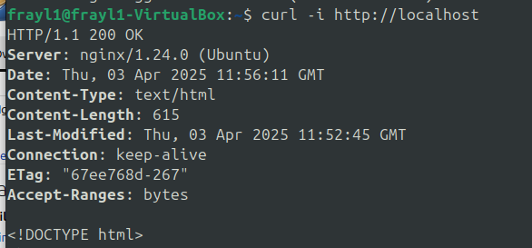
- Додавання PPA-репозиторію

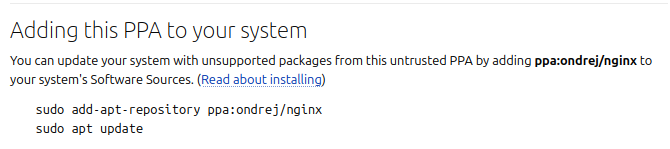
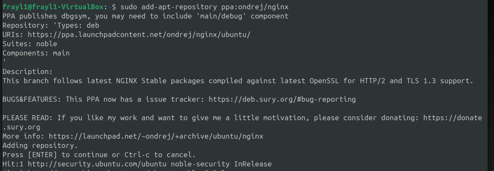
- Оновлення пакетів

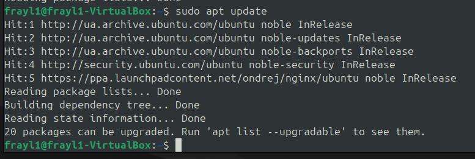
- Перевірка версії
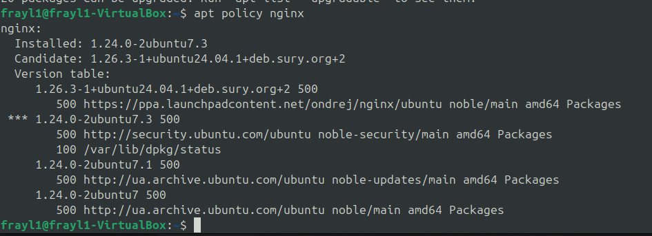
- Перевстановлення nginx

- Встановлення ppa-purge

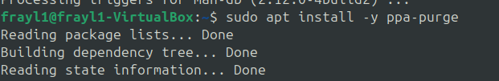
- Видалення ppa
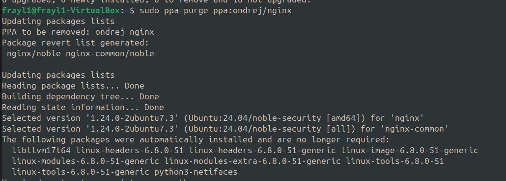
- Оновлення пакетів та перевстановлення nginx
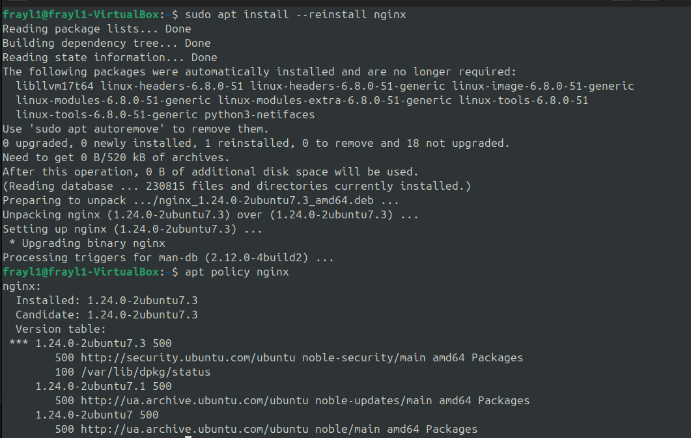
- Перевірка роботи

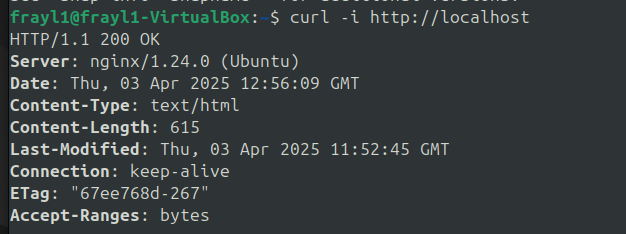

2. **Написати й налаштувати власний systemd-сервіс для запуску простого скрипта (наприклад, скрипт, який пише поточну дату і час у файл щохвилини).**
- Створення скрипта для виводу дати та часу:
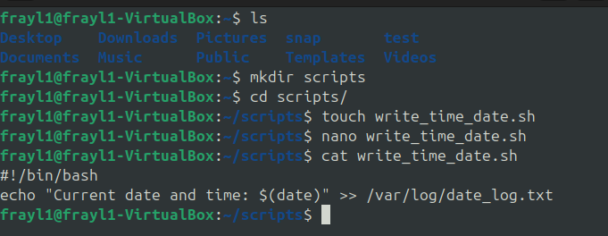
- Створення сервісу(служби)
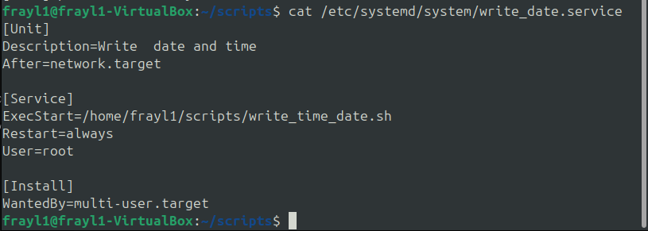
- Створення таймера

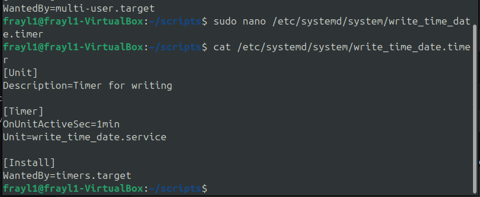
- Запуск служби (1 запис був виконаний вручну запуском скрипта для його перевірки)
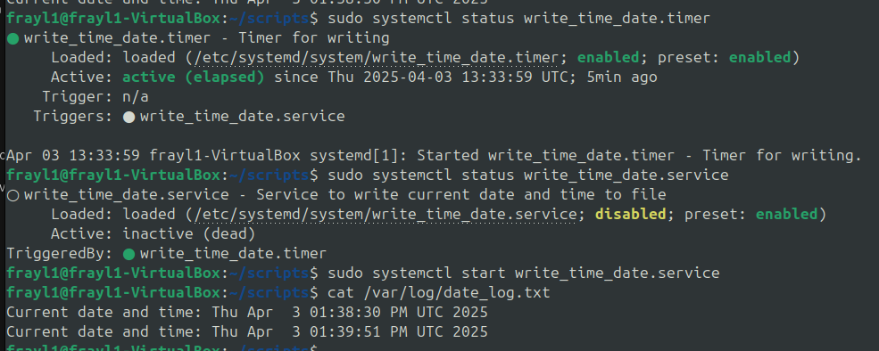
- Сервіс працює коректно

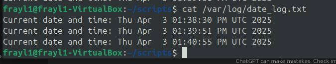

3. **Налаштувати брандмауер за допомогою UFW або iptables. Заборонити доступ до порту 22 (SSH) з певного IP, але дозволити з іншого IP. Налаштувати Fail2Ban для захисту від підбору паролів через SSH.**

- Перевіряємо доступність по ssh

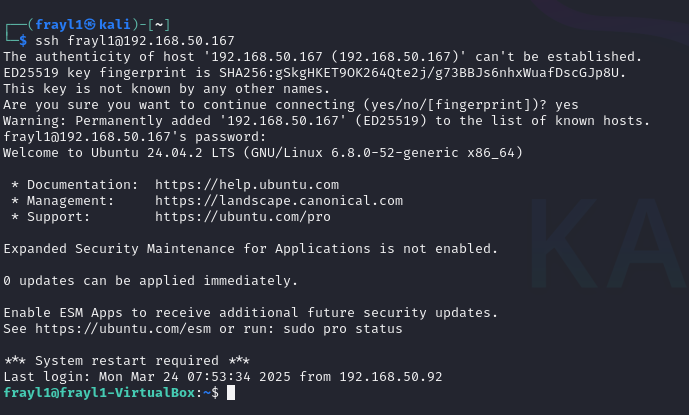
Бачимо що доступ до ssh є, заборонимо його для конкрутної ip
- ip 2ї машини

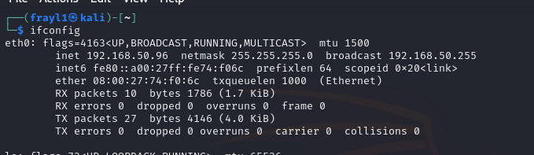

- Забороняємо доступ:

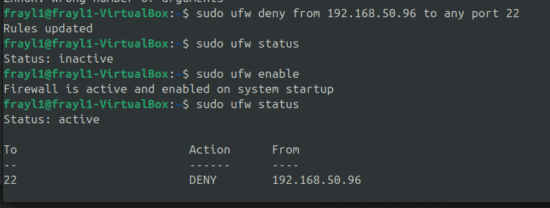
- Спроба підключитись: (підключення не відбувається)

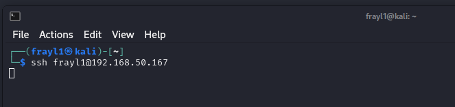

- Додали дозвіл на підключення
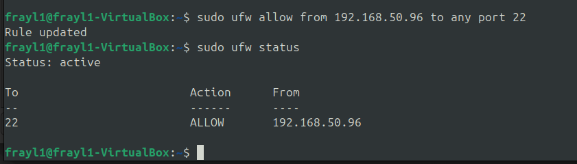

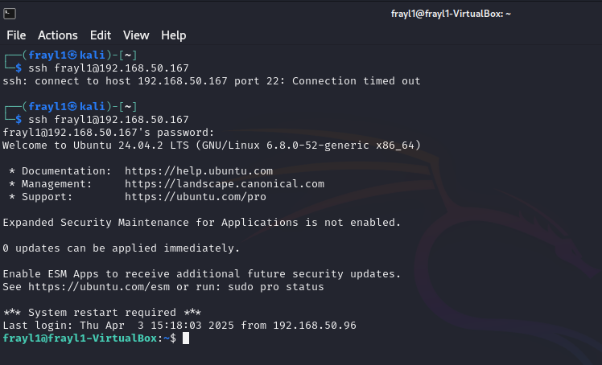

- Завантаження Fail2Ban

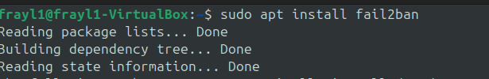

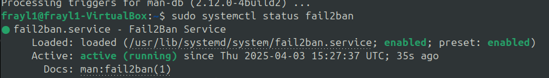

- Створення конфігурації (блокування після 3х спроб на 1хв)

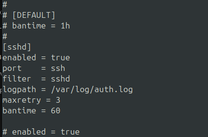

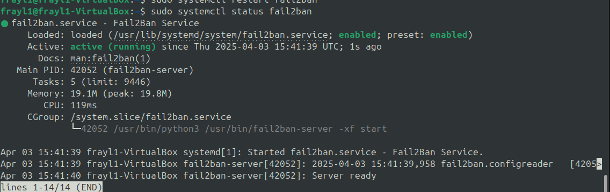

- Спрацювання правила

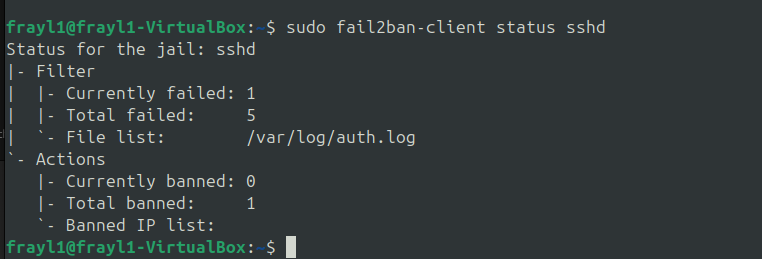
